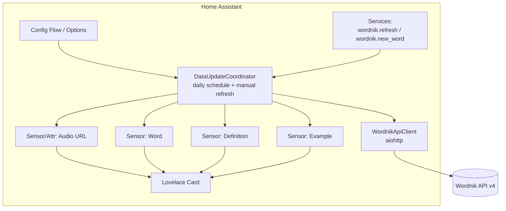

# Wordnik "Word of the Day" — Home Assistant Integration Plan

> Status: **APPROVED — implementation in progress.**
> Target: Custom Home Assistant integration distributed via HACS, backed by the
> [Wordnik API](https://developer.wordnik.com/docs), surfaced through a companion
> Lovelace card.

---

## 1. Goals & Scope

### 1.1 Primary goal
Deliver a "Word of the Day" experience in Home Assistant:
- Pull a daily word from Wordnik.
- Expose **word, definition, example, and audio** (minimum viable data set).
- Update automatically on a **daily schedule**, with an **on-demand refresh**.
- Provide a **difficulty selector** with multiple graduated tiers (see §4),
  spanning early readers through expert-level vocabulary.
- Ship a **Lovelace card** to present the word nicely (text + play-audio button).

### 1.2 Explicit minimum requirements (from brief)
| Requirement | Source endpoint (Wordnik v4) |
|-------------|------------------------------|
| Word | `wordOfTheDay` / `randomWords` |
| Definition | `word/{word}/definitions` |
| Example | `word/{word}/examples` (or `topExample`) |
| Audio | `word/{word}/audio` |

### 1.3 Out of scope (initial release)
- Multi-language / non-English dictionaries.
- Text-to-speech synthesis fallback when Wordnik has no audio (tracked as a follow-up).
- Historical word archive / calendar browsing UI.

---

## 2. Wordnik API Notes (constraints that shape the design)

- **Base URL:** `https://api.wordnik.com/v4`
- **Auth:** single `api_key` query parameter. User must self-register at
  developer.wordnik.com (keys can take up to 7 days unless a $5 donation is made).
- **Rate limits:** per-minute and per-hour, returned in response headers
  (`x-ratelimit-remaining-hour`, `x-ratelimit-remaining-minute`, etc.). Design must
  be conservative — batch the daily fetch and cache aggressively.
- **Attribution (mandatory):** responses include `attributionText`; per Wordnik
  Terms we **must** display attribution and link back to Wordnik wherever data is
  shown. The card and an entity attribute must carry this.
- **Difficulty is not a native concept.** Wordnik's official `wordOfTheDay` is a
  single curated word with no difficulty tier. We implement the graduated tiers
  ourselves (see §4).

### 2.1 Endpoints we will use
| Purpose | Endpoint |
|---------|----------|
| Official curated daily word | `GET /words.json/wordOfTheDay` |
| Difficulty-filtered word pick | `GET /words.json/randomWords` (filters below) |
| Definitions | `GET /word.json/{word}/definitions` |
| Examples | `GET /word.json/{word}/examples` |
| Audio clips | `GET /word.json/{word}/audio` |
| Pronunciation (optional, nice-to-have) | `GET /word.json/{word}/pronunciations` |

### 2.2 Key `randomWords` filters (for difficulty)
- `hasDictionaryDef=true` — guarantees a usable definition.
- `minCorpusCount` / `maxCorpusCount` — corpus frequency ≈ how common/known the word is.
- `minLength` / `maxLength` — shorter words trend simpler.
- `includePartOfSpeech` / `excludePartOfSpeech` — e.g. exclude proper nouns/abbreviations.

---

## 3. High-Level Architecture



- **`WordnikApiClient`** — thin async wrapper (aiohttp via HA's shared session),
  handles auth, retries, rate-limit awareness, and error mapping.
- **`WordnikCoordinator`** (`DataUpdateCoordinator`) — orchestrates the multi-call
  daily fetch (pick word → definition → example → audio), caches the assembled
  result, and drives all entities from one payload.
- **Entities** — a device ("Wordnik Word of the Day") grouping the sensors below.
- **Services** — `wordnik.refresh` (silent re-pull / retry of today's word) and
  `wordnik.new_word` (force a fresh word pick, bypassing the daily seed).

---

## 4. Difficulty Tiers

Because Wordnik has no native difficulty concept, we derive graduated tiers from
corpus frequency (how common a word is), word length, and part-of-speech filters.
Rather than a simple kids/adults toggle, the integration offers a **five-tier
vocabulary scale** with descriptive, non-age-shaming names.

### 4.1 Proposed tiers

| Tier (slug) | Display name | Audience / feel | Rough filter profile |
|-------------|--------------|-----------------|----------------------|
| `sprout` | **Sprout** | Early readers (~ages 4–7) | Very high `minCorpusCount`, `maxLength` ~6, exclude proper nouns/abbreviations |
| `explorer` | **Explorer** | Growing readers (~ages 8–12) | High `minCorpusCount`, `maxLength` ~9 |
| `everyday` | **Everyday** | General adult, familiar words | Mid corpus band, no strict length cap |
| `scholar` | **Scholar** | Rich / advanced vocabulary | Lower `minCorpusCount`, allow longer words |
| `luminary` | **Luminary** | Rare, obscure, word-nerd tier | Low corpus band, rare words, `hasDictionaryDef=true` |

All tiers enforce `hasDictionaryDef=true` so every word has a usable definition.
The exact corpus/length thresholds are **tunable constants** (in `const.py`) so
they can be calibrated after real-world testing — the boundaries between tiers are
inherently fuzzy.

### 4.2 Selection strategy — **decided: Strategy A**

**Strategy A — Deterministic daily pick via `randomWords` (chosen).**
- Each tier maps to one of the filter profiles above.
- To keep the word stable within a day (not changing on every reload), seed the
  selection with the current date (+ tier) so a given day yields a consistent word
  per tier. The `wordnik.new_word` service / card button bypasses this seed to pull
  a fresh word on demand.

> Content-safety note (**decided: best-effort**): even the `sprout`/`explorer`
> tiers cannot guarantee child-appropriate words from a general corpus. We apply a
> best-effort corpus/part-of-speech filter plus an optional user blocklist, and
> document the limitation clearly in the README.

---

## 5. Entities / Sensors Specification

Device: **Wordnik Word of the Day** (one config entry per tier; multiple entries
allowed so several tiers can run simultaneously, e.g. Sprout + Scholar).

| Entity | Type | State | Key attributes |
|--------|------|-------|----------------|
| `sensor.wordnik_word` | sensor | the word | part of speech, difficulty tier, source date, `attribution` |
| `sensor.wordnik_definition` | sensor | primary definition text | source dictionary, all definitions[], `attribution` |
| `sensor.wordnik_example` | sensor | example sentence | example source/title |
| `sensor.wordnik_audio` | sensor | audio URL (or `unknown`) | duration, all audio[], MIME/format |
| `sensor.wordnik_pronunciation` | sensor | phonetic spelling | raw type (IPA/arpabet) |

Pronunciation is **included by default** (can be hidden via an option). Entity IDs
are namespaced by tier when multiple entries exist (see §5.1).

Notes:
- Long text may exceed HA's 255-char state limit → truncate state, keep full text
  in an attribute (documented pattern).
- Audio exposed as URL attribute so the card / a `media_player` can play it.

### 5.1 Running multiple tiers (multiple config entries)

Each tier runs as its **own config entry** — you can add as many as you like
(e.g. **Sprout** for the kids' dashboard and **Scholar** for your office).

- **Adding:** the initial config flow lets you pick one or more tiers; each
  selected tier is created as a separate entry. You can also re-run "Add
  Integration" later to add another tier.
- **Uniqueness:** each entry's unique ID is its tier slug, so the same tier can't
  be added twice by accident.
- **Isolation:** every entry gets its own device, coordinator, daily schedule, and
  options — one tier failing or refreshing never affects another.
- **Naming:** device and entities are namespaced by tier, e.g.
  device **"Wordnik — Scholar"** with `sensor.wordnik_scholar_word`,
  `sensor.wordnik_scholar_definition`, etc.
- **Shared API key:** the key is entered once and reused for additional tiers
  (pre-filled from an existing entry) so you don't re-enter it per tier.
- **Rate limits:** each entry performs a single assembled fetch per day, so even
  several tiers stay well within Wordnik's per-minute/hour limits.
- **Card binding:** each card instance targets one entry/device, so a dashboard
  can show different tiers side by side.

---

## 6. Scheduling & Refresh

- **Daily update:** the word rolls over at a **configurable local time (default
  midnight, 00:00)**, set per entry in options. The coordinator aligns its next
  run to that time.
- **Silent refresh / retry:** `wordnik.refresh` service (optionally targeting a
  specific config entry) re-pulls today's word — used for error recovery.
- **New word on demand:** `wordnik.new_word` service forces a fresh pick,
  bypassing the daily date seed. This backs the card's **"New Word"** button.
- **Rate-limit safety:** one assembled fetch per update; results cached between
  scheduled runs so entity reloads/restarts don't spam the API.
- **Failure handling:** on API/network error, retain last good value and mark
  entities appropriately; surface a `last_update_success` style indicator.

---

## 7. Configuration (Config Flow + Options)

**Config flow (setup):**
1. API key (required; validated with a test call; reused/pre-filled for extra tiers).
2. Difficulty tier(s) — one or more of Sprout / Explorer / Everyday / Scholar /
   Luminary (each selected tier becomes its own entry, see §5.1).
3. Daily rollover time (default **midnight, 00:00**).

**Options flow (reconfigurable, per entry):**
- Filter thresholds for the tier (corpus/length overrides).
- Rollover time.
- Show/hide pronunciation sensor (shown by default).
- Optional word blocklist (best-effort content safety).
- **Default audio playback target** — in-browser `<audio>` **or** a chosen
  `media_player` entity (used by the card's play button unless overridden there).

All secrets (API key) stored in the config entry, never logged.

---

## 8. Lovelace Card (polished custom card)

We ship a dedicated custom card, **`wordnik-card`**, as the primary presentation
layer (no interim markdown/button-card recipe). Because a HACS repository is a
**single category**, the card is **bundled inside the integration** rather than
published as a separate HACS plugin: the integration serves the compiled JS from
`custom_components/wordnik/` and **auto-registers it as a Lovelace module
resource** at startup. A single HACS “integration” install therefore delivers both
the backend and the card — no manual resource setup. It remains configurable via
the standard card picker + visual editor.

### 8.1 Technology
- **LitElement + TypeScript**, bundled with **Rollup/esbuild** to a single
  `wordnik-card.js`, checked into the integration folder
  (`custom_components/wordnik/www/wordnik-card.js`).
- The integration registers a static path and adds the module to the frontend
  (`async_register_static_path` + `frontend.add_extra_js_url` / Lovelace resource),
  so HACS handles install/versioning of the whole package as one `integration`.
- Uses HA theme CSS variables (`--primary-text-color`, `--card-background-color`,
  `--ha-card-border-radius`, etc.) so it inherits the user's theme and dark mode.
- Ships a **GUI config editor** (`getConfigElement` / `getStubConfig`) so it can
  be added and configured without YAML.

### 8.2 Layout / rendering

```
┌──────────────────────────────────────┐
│  WORD OF THE DAY            [Scholar ⭐]  │  ← header: title + tier badge
│                                          │
│  serendipity            ▶ (play audio)   │  ← word (large) + audio button
│  /ˌserənˈdɪpɪti/   noun                    │  ← pronunciation + part of speech
│                                          │
│  The occurrence of happy events by       │  ← definition block
│  chance in a happy way.                   │
│                                          │
│  “A fortunate stroke of serendipity      │  ← example (italic, quoted)
│   brought them together.”                 │
│                                          │
│  from Wiktionary · Wordnik      ↻ New Word │  ← attribution footer + New Word
└──────────────────────────────────────┘
```

Rendered regions:
1. **Header** — card title (configurable, default “Word of the Day”) and a colored
   **tier badge** (Sprout/Explorer/Everyday/Scholar/Luminary), each tier with its
   own accent color/icon.
2. **Word row** — the word in large type, with an inline **play-audio button**
   (disabled/hidden when the word has no audio clip).
3. **Sub-line** — pronunciation (phonetic) + part of speech, muted styling.
4. **Definition block** — primary definition; optional “show more” expander when
   multiple definitions exist (reads from the entity's attributes).
5. **Example block** — quoted, italicized example sentence (hidden if none).
6. **Footer** — mandatory **Wordnik attribution** (`attributionText`) + a link to
   the word's Wordnik page, and a **“New Word” button** (shuffle/dice icon) that
   calls `wordnik.new_word` to fetch a fresh word on demand. *(Name chosen over
   “Refresh” since the daily word is otherwise stable; alternatives considered:
   Shuffle, Surprise Me, Fresh Word.)*

### 8.3 Behavior & states
- **Data source:** the card is bound to the config entry / device; it reads the
  `word`, `definition`, `example`, `audio`, and `pronunciation` sensors and their
  attributes. Card config: `entity` (word sensor) or `device_id`, plus display
  toggles (show pronunciation, show example, show New Word button, title).
- **Audio playback:** clicking the play button follows a card-level audio mode:
  **Wordnik audio**, **HA TTS**, or **hidden**. Wordnik audio uses the existing
  locally cached audio URL and can play in the browser or through the selected
  `media_player`. HA TTS calls Home Assistant's `tts.speak` service with the
  current word as the message, a configured TTS entity, and a selected
  `media_player` target. Hidden mode removes the play button and makes no audio
  service call, including when the Wordnik audio sensor has a value.
- **Audio configuration:** replace the current `audio_mode: browser | media_player`
  distinction with an explicit source setting, for example
  `audio_source: wordnik | tts | hidden`. Keep the existing browser playback
  behavior as the default destination for Wordnik audio, and retain an optional
  media-player destination where useful. TTS mode requires both a `tts` entity
  and a `media_player` entity; the visual editor should only show those fields
  when TTS is selected and should not allow an incomplete configuration to be
  saved. The exact field names should be finalized before implementation.
- **Missing data and failures:** disable the Wordnik play button when Wordnik
  audio is unavailable; in TTS mode the button remains usable as long as the
  word sensor has a valid word. Surface a concise toast when a TTS or media
  player service call fails. Hidden mode must not show an unavailable-audio
  affordance.
- **Migration:** existing cards using `audio_mode: browser` continue to play
  cached Wordnik audio. Existing `audio_mode: media_player` cards continue to
  cast Wordnik audio. New cards use Wordnik audio as their default source.
  Decide whether to expose the legacy keys only for YAML compatibility or to
  normalize them in `setConfig` before the editor renders.
- **New Word action:** the footer button calls `wordnik.new_word` for this entry,
  then shows the freshly picked word once the coordinator updates.
- **Loading state:** skeleton/placeholder while the coordinator has no data yet.

### 8.4 HA TTS design details
- Use the standard `tts.speak` service rather than browser speech synthesis, so
  the selected Home Assistant TTS provider and media player handle synthesis and
  playback. Pass the displayed word exactly as the message; do not send the
  definition or example unless that becomes a separate product option.
- The card editor should select `tts` entities from the entity registry and
  `media_player` entities from the media-player domain. A media player is
  required because `tts.speak` needs a playback target; this also avoids
  pretending that the browser's local audio element is equivalent to HA TTS.
- The play handler should stop any active browser audio before invoking TTS,
  prevent duplicate calls while a request is in flight, and restore the button
  state after success or failure. Do not make a TTS call automatically on word
  rollover or card load; synthesis is user initiated.
- Verify the exact frontend `hass.callService` argument shape against the HA
  version supported by the integration. The target should identify the TTS
  entity, while service data should include `media_player_entity_id` and
  `message`, matching the installed HA TTS service schema.

### 8.5 Implementation and test plan
1. Define constants and defaults for the three source values, plus the selected
   TTS and media-player entity keys. Document the new YAML shape and migration
   behavior in the README.
2. Update `wordnik-card.js` configuration normalization, editor schema, labels,
   conditional selectors, button visibility, and button title/icon. Keep the
   existing Wordnik browser/cast implementation isolated from the new TTS path.
3. Add a small card test harness or browser test that supplies mocked HA states
   and `hass.callService`, then verifies Wordnik playback, TTS payload and
   target, hidden mode, unavailable Wordnik audio, and service failure handling.
4. Add regression coverage for legacy `audio_mode` configurations and confirm
   the visual editor does not retain stale TTS/media-player fields after the
   source changes.
5. Run the focused card tests, the existing Python test suite, and a manual
   dashboard check with one Wordnik-audio card, one TTS card, and one hidden
   card. Confirm that no Wordnik audio download or TTS call is triggered merely
   by rendering or updating the card.
- **Error/unavailable state:** if entities are `unavailable`, show a compact
  message and keep the New Word button active.
- **No-audio words:** play control hidden or greyed with a tooltip.
- **Accessibility:** semantic markup, `aria-label`s on the icon buttons, focus
  styles, and sufficient contrast via theme variables.
- **Responsive:** single-column layout that adapts to narrow (mobile) and wide
  (masonry/sections) dashboard columns.

### 8.4 Tier theming
Each tier gets an accent color and icon used by the badge (and optionally a subtle
card accent), configurable/overridable via card options and theme variables so it
fits custom themes.

---

## 9. HACS Packaging & Repo Structure

```
hacs-wordnik/
├── custom_components/
│   └── wordnik/
│       ├── __init__.py            # setup, coordinator wiring, service + card reg
│       ├── manifest.json          # domain, version, requirements, codeowners
│       ├── config_flow.py         # config + options flow
│       ├── const.py               # domain, defaults, difficulty profiles
│       ├── coordinator.py         # DataUpdateCoordinator
│       ├── api.py                 # WordnikApiClient (aiohttp)
│       ├── sensor.py              # sensor entities
│       ├── services.yaml          # wordnik.refresh + wordnik.new_word
│       ├── strings.json           # config flow strings
│       ├── translations/en.json
│       └── www/
│           └── wordnik-card.js    # bundled Lovelace card (self-registered)
├── card-src/                       # card TypeScript source + build config
├── hacs.json                       # HACS metadata (category: integration)
├── docs/
│   └── PLAN.md                    # this file
├── README.md                      # install, config, card setup, attribution
├── LICENSE
└── .github/workflows/             # hassfest + HACS validation CI
```

Requirements for HACS default/custom listing:
- `manifest.json` with `domain`, `name`, `version`, `documentation`, `issue_tracker`,
  `codeowners`, `iot_class` (`cloud_polling`), `config_flow: true`.
- `hacs.json` (name, min HA version `2026.06`, etc.).
- Repo passes **`hassfest`** and **HACS validation** GitHub Actions.
- Icon/branding submitted to `home-assistant/brands` (separate PR) for the logo.
- Semantic versioning + GitHub releases (HACS installs from tags/releases).

---

## 10. Attribution & Legal Compliance

- Display `attributionText` from every definition/example next to the content
  (card footer + entity attribute).
- Link back to Wordnik (word page `https://www.wordnik.com/words/{word}`).
- Include Wordnik terms link in README; document that users supply their own API
  key and are bound by Wordnik's ToS.
- Do not cache/redistribute Wordnik data beyond operational use.

---

## 11. Testing & Quality

- Unit tests for `WordnikApiClient` (mocked aiohttp responses, error paths,
  rate-limit headers).
- Config-flow tests (valid/invalid key, options).
- Coordinator tests (assembly of word→def→example→audio, partial-failure fallback).
- CI: `hassfest`, HACS validation, `ruff`/lint, `pytest` with
  `pytest-homeassistant-custom-component`.
- Manual test matrix: each tier, no-audio word, rate-limit hit, network outage,
  `wordnik.refresh` retry, and `wordnik.new_word` fresh pick.

---

## 12. Decisions & Remaining Questions

**Decisions (locked in):**
1. **Difficulty strategy:** Strategy A — deterministic daily `randomWords` pick,
   date+tier seeded for stability; `new_word` bypasses the seed.
2. **Tier set:** confirmed — Sprout / Explorer / Everyday / Scholar / Luminary.
3. **Kids content safety:** best-effort corpus/part-of-speech filter + optional
   user blocklist; limitation documented.
4. **Audio playback target:** a **configuration option** (in-browser `<audio>` or a
   chosen `media_player`), overridable per card.
5. **Multiple entries:** supported — one entry per tier, run any number side by
   side (see §5.1).
6. **Pronunciation sensor:** included by default (option to hide).
7. **Rollover:** configurable per entry, **default midnight (00:00)**.
8. **Card “New Word” action:** footer button calls `wordnik.new_word` for a fresh
   word on demand.

**Remaining question:**
- **Target minimum Home Assistant version:** **2026.06** (locked). Integration
  `manifest.json`/`hacs.json` and CI matrix will pin to this baseline.

---

## 13. Proposed Milestones

- **M0 — Approval & decisions** (this doc; §12 decisions locked, min HA 2026.06).
- **M1 — Core integration:** API client, coordinator, sensors (incl. pronunciation),
  multi-tier config flow, daily schedule (default midnight), `wordnik.refresh` +
  `wordnik.new_word` services. Passes hassfest/HACS validation.
- **M2 — Difficulty tiers** tuned + best-effort blocklist + per-tier options.
- **M3 — Lovelace presentation:** polished `wordnik-card` custom card (LitElement +
  TypeScript) with GUI editor, configurable audio playback, tier theming, “New
  Word” button, and attribution footer.
- **M4 — Hardening:** tests, CI, README, brands PR, first tagged release.

---

*Prepared for review. Reply with answers to §12 and "approved" to begin implementation.*
